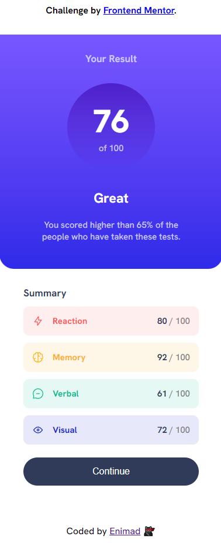

# Frontend Mentor - QR code component

## Table of contents

- [Overview](#overview)
  - [Screenshot](#screenshot)
  - [Links](#links)
- [My process](#my-process)
  - [Built with](#built-with)

## Overview

The challenge is to build out a Results summary component (based on an image) and get it looking as close to the template as possible.

### Screenshot

### Links

- Solution URL: https://github.com/enimad/Results-summary-component
- Live Site URL: https://enimad.github.io/Results-summary-component/

## My process

HTML:
- I created the structure in order to make it easily responsive

CSS:
- I created all the styling in order to get as close as possible to the templates and to make it responsive (Desktop and mobile)

### Built with

- Semantic HTML5 markup
- CSS custom properties
- Flexbox
- CSS Grid
